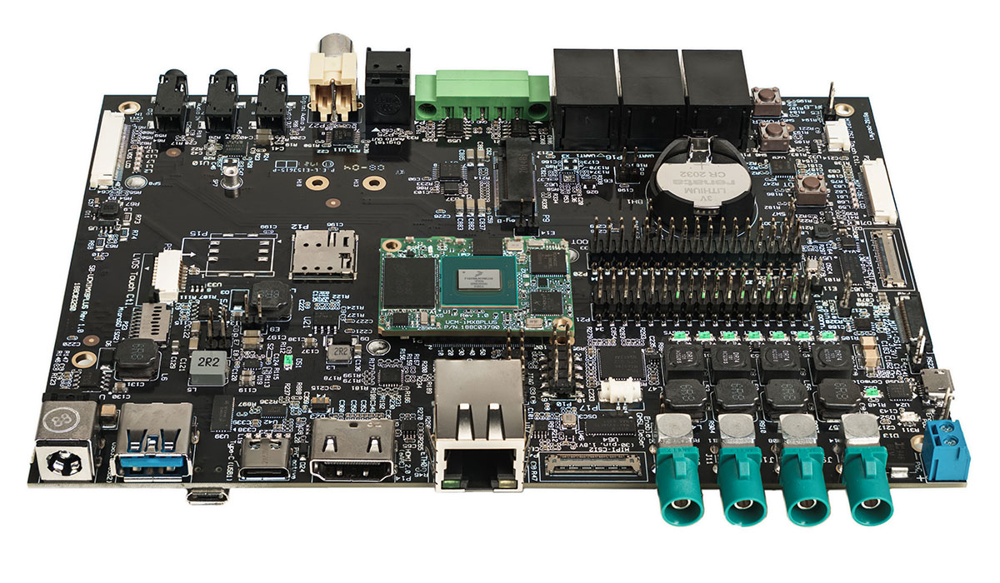
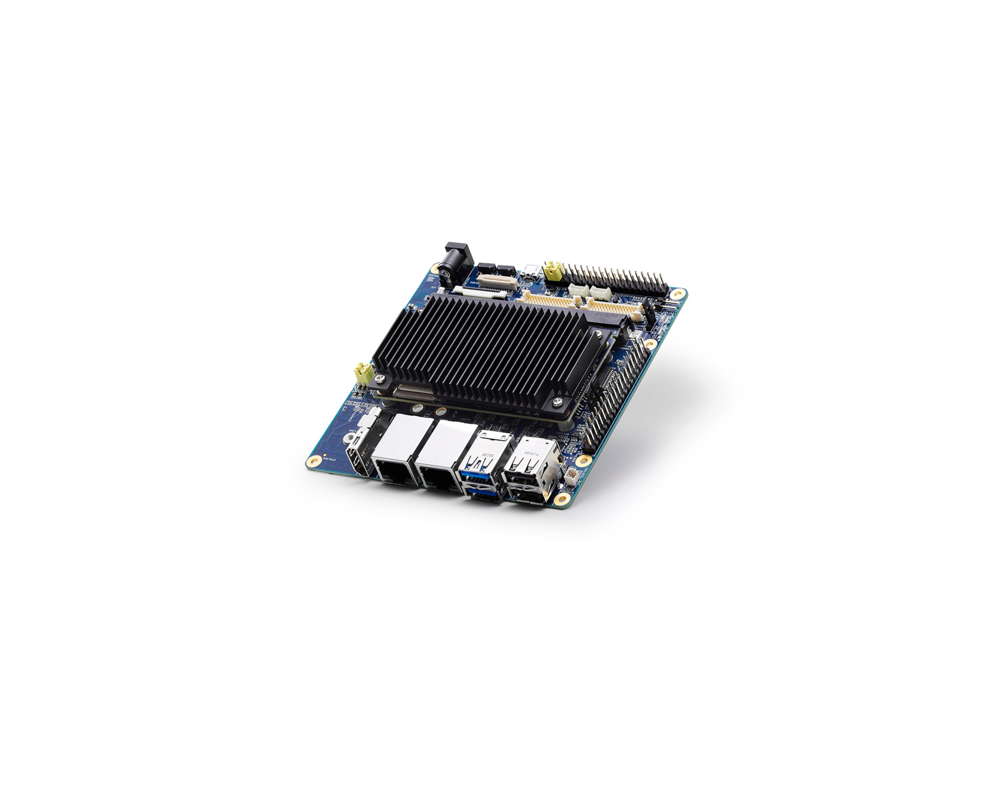

# i.MX8 Plus

This is concerned with getting up and running on two carrier boards and later on our own.

- [SB-UCM-iMX8PLUS](https://www.compulab.com/products/carrier-boards/sb-ucmimx8plus-carrier-board/#diagram).
- [I-Pi_SMARC-IMX8M-PLUS](https://www.ipi.wiki/pages/imx8mp-docs)
- [SMARC Modules](https://sget.org/standards/)
- 

Source code and build scripts are found under [device/imx8](./device/imx8/README.md)

## Notes to integrate

The I-Pi board has 4 dip switches on the board hidden near the Ethernet connectors. Use 1000 for eMMC / 0110 for SD booting.

